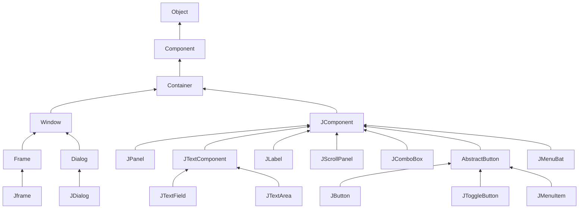

# 第12章 Swing用户界面组件

## 12.1 Swing和模型-视图-控制器设计模式

### 12.1.1 设计模式

近几年来， 软件工程师们开始对这些模式进行汇总分类。这个领域的先驱者的灵感来源于建筑师 Christopher Alexander 的设计模式。 

模型-视图-控制器模式并不是 AWT 和 Swing 设计中使用的唯一模式。下列是应用的另外几种模式：

•容器和组件是“ 组合（composite )” 模式
•带滚动条的面板是“ 装饰器（decorator)” 模式
•布局管理器是“ 策略（strategy)” 模式 

### 12.1.2 模型-视图-控制器模式

Swing 设计者采用了一种很有名的设计模式（design pattern ) : 模型 - 视图 - 控制器 （ model-view-controller) 模式。这种设计模式同其他许多设计模式一样，都遵循第 5 章介绍过的面向对象设计中的一个基本原则： 限制一个对象拥有的功能数量。不要用一个按钮类完成所有的事情， 而是应该让一个对象负责组件的观感， 另一个对象负责存储内容。模型-视图- 控制器（MVC) 模式告诉我们如何实现这种设计，实现三个独立的类：

•模型 （model ): 存储内容。
•视图 （view): 显示内容。
•控制器（controller): 处理用户输入。

这个模式明确地规定了三个对象如何进行交互。**模型**存储内容， 它没有用户界面。 

模型必须实现改变内容和查找内容的方法。 	记住：模型是完全不可见的。显示存储在模型中的数据是视图的工作。 

模型-视图-控制器模式的一个优点是一个模型可以有多个视图， 其中每个视图可以显示全部内容的不同部分或不同形式。 例如， 一个 HTML 编辑器常常为同一内容在同一时刻提供两个视图： 一个 WYSIWYG (所见即所得）视图和一个“ 原始标记” 视图。

**控制器**负责处理用户输入事件，如点击鼠标和敲击键盘。然后决定是否把这些事件转化成对模型或视图的改变。 

除了“ 本职工作” 外，模型-视图- 控制器模式吸引 Swing 设计者的主要原因是这种模式允许实现可插观感。  

### 12.1.3 Swing按钮的模型-视图-控制器分析

对于大多数组件来说， 模型类将实现一个名字以 Model 结尾的接口， 例如，按钮就实现了 ButtonModel 接口。实现了此接口的类可以定义各种按钮的状态。 

对于一个按钮来说， 仅凭模型无法知道它的外观（实际上， 在有关单选钮的 12.4.2 节中将会看到，这种纯粹的设计会给程序员带来一些麻烦)。 

需要注意的是， 同样的模型（即 DefaultButtonModel ) 可用于下压按钮、单选按钮、复选框、甚至是菜单项。当然， 这些按钮都有各自不同的视图和控制器。当使用 Metal 观感时，JButton 类用 BasicButtonUI 类作为其视图； 用 ButtonUIListener 类作为其控制器。通常， 每个 Swing 组件都有一个相关的后缀为 UI 的视图对象， 但并不是所有的 Swing 组件都有专门的控制器对象。 

在阅读 JButton 底层工作的简介之后可能会想到： JButton 究竟是什么？ 事实上， 它仅仅是一个继承了 JComponent 的包装器类， JComponent 包含了一个 DefauUButtonModel 对象，一些视图数据（例如按钮标签和图标）和一个负责按钮视图的 BasicButtonUI 对象。 

## 12.2 布局管理概述

回顾上一章的程序， 我们设计了几个按钮，点击这些按钮可以改变框架的背景颜色。

这几个按钮被放置在一个 JPanel 对象中， 且用流布局管理器（ flow layout manager) 管理， 这是面板的默认布局管理器。当一行的空间不够时，会将显示在新的一行上。 

另外， 按钮总是位于面板的中央， 即使用户对框架进行缩放也是如此。  

通常， 组件放置在容器中， 布局管理器决定容器中的组件具体放置的位置和大小。 

*注释： 可惜的是， 继承层次有两点显得有点混乱。 首先， 像 JFrame 这样的顶层窗口是 Container 的子类， 所以也是 Component 的子类， 但却不能放在其他容器内。 另外，JComponent 是 Container 的子类， 但不直接继承 Component, 因此， 可以将其他组件添置到 JButton 中。（但无论如何， 这些组件无法显示出来）。*

每个容器都有一个默认的布局管理器，但可以重新进行设置。 例如， 使用下列语句：
`panel.setLayout(new GridLayout(4, 4));`
这个面板将用 GridLayout 类布局组件。可以往容器中添加组件。容器的 add 方法将把组件和放置的方位传递给布局管理器 

【API】java.awt.Container 1.0

- `Void SetLayout(LayoutManager m)`
  为容器设置布局管理器
- `Component add(Component c)`
- `Component add(Component c, Object constraints)` 1.1
  将组件添加到容器中， 并返回组件的引用。
  参数： c 要添加的组件
  constraints 布局管理器理解的标识符

【API】 java.awt.FlowLayout 1.0

- `FIowLayout ()`

- `FIowLayout(int align)`

- `FIowLayout (int align, int hgap , int vgap)`
  构造一个新的 FlowLayout 对象。
  参数： align LEFT、 CENTER 或者 RIGHT

  hgap 以像素为单位的水平间距（如果为负值， 则强行重叠）
  vgap 以像素为单位的垂直间距（如果为负值，则强行重叠） 

### 12.2.1 边框布局

