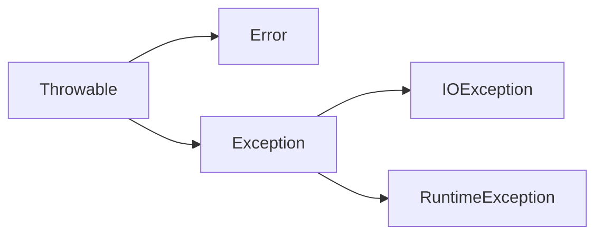

# 第7章 异常、断言和日志

对于异常情况， 例如， 可能造成程序崩溃的错误输入， Java 使用一种称为**异常处理( exception handing)** 的错误捕获机制处理。  

## 7.1 处理错误

如果由于出现错误而使得某些操作没有完成， 程序应该：

- 返回到一种安全状态，并能够让用户执行一些其他的命令；或者
- 允许用户保存所有操作的结果，并以妥善的方式终止程序 

要做到这些并不是一件很容易的事情。其原因是检测（或引发）错误条件的代码通常离那些能够让数据恢复到安全状态， 或者能够保存用户的操作结果， 并正常地退出程序的代码很远。异常处理的任务就是将控制权从错误产生的地方转移给能够处理这种情况的错误处理器。 

1. 用户输入错误
2. 设备错误
3. 物理限制
4. 代码错误

在 Java 中， 如果某个方法不能够采用正常的途径完整它的任务，就可以通过另外一个路径退出方法。在这种情况下，方法并不返回任何值， 而是抛出( throw) 一个封装了错误信息的对象。需要注意的是，这个方法将会立刻退出，并不返回任何值。 此外， 调用这个方法的代码也将无法继续执行，取而代之的是， 异常处理机制开始搜索能够处理这种异常状况的异常处理器 （exception handler )。 

### 7.1.1 异常分类

在 Java 程序设计语言中， 异常对象都是派生于 Throwable 类的一个实例。 

Error 类层次结构描述了 Java 运行时系统的内部错误和资源耗尽错误。 应用程序不应该抛出这种类型的对象。 如果出现了这样的内部错误， 除了通告给用户，并尽力使程序安全地终止之外， 再也无能为力了。 

在设计 Java 程序时， 需要关注 Exception 层次结构。 这个层次结构又分解为两个分支：一个分支派生于 RuntimeException ; 另一个分支包含其他异常。划分两个分支的规则是： 由程序错误导致的异常属于 RuntimeException ; 而程序本身没有问题， 但由于像 I/O 错误这类问题导致的异常属于其他异常: 

派生于 RuntimeException 的异常包含下面几种情况：

- 错误的类型转换。
- 数组访问越界 。
- 访问 null 指针。

不是派生于 RuntimeException 的异常包括：

- 试图在文件尾部后面读取数据。
- 试图打开一个不存在的文件。
- 试图根据给定的字符串查找 Class 对象， 而这个字符串表示的类并不存在 。

Java 语 言 规 范 将 派 生 于 Error 类 或 RuntimeException 类的所有异常称为**非受查( unchecked ) 异常**， 所有其他的异常称为**受查（ checked) 异常**。这是两个很有用的术语，在后面还会用到。 编译器将核查是否为所有的受査异常提供了异常处理器。 

*注释： RuntimeException 这个名字很容易让人混淆。 实际上， 现在讨论的所有错误都发生在运行时。*

*C++ 注释：如果熟悉标准 C++ 类库中的异常层次结构， 就一定会感到有些困惑。 C++ 有两个基本的异常类， 一个是 runtime_error ; 另一个是 logic_error。 logic_error 类相当于Java 中的 RuntimeException， 它表示程序中的逻辑错误；runtime_error 类是所有由于不可预测的原因所引发的异常的基类。它相当于 Java 中的非 RuntimeException 异常。*

### 7.1.2 声明受查异常

