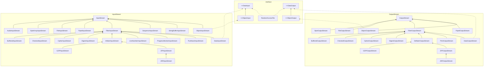
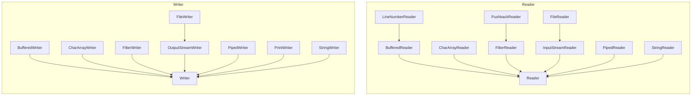
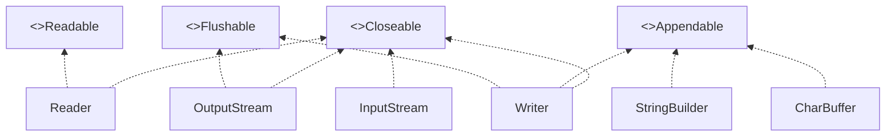

# 第2章 输入与输出

## 2.1 输入/输出流

在Java API中，可以从其中读入一个字节序列的对象称作**输入流**，而可以向其中写入一个字节序列的对象称作**输出流**。这些字节序列的来源地和目的地可以是文件，而且通常都是文件，但是也可以是网络连接，甚至是内存块。抽象类InputStream和OutputStream构成了输入/输出（I/O)类层次结构的基础。

*注意：这些输入/输出流与在前一章中看到的流没有任何关系。为了清楚起见，只要是讨论用于输入和输出的流，我们都将使用术语输入流、输出流或输入/输出流。*

### 2.1.1 读写字节

InputStream类有一个抽象方法read()

这个方法将读入一个字节，并返回读入字节，或者在遇到输入源结尾时返回-1。在设计具体的输入流类时，必须覆盖这个方法以提供适用的功能。

InputStream类还有若干个非抽象的方法，它们可以读入一个字节数组，或者跳过大量的字节。这些方法都要调用抽象的read方法，因此，各个子类都只需覆盖这一个方法。

与此类似，OutputStream类定义了下面的抽象方法：write(int b)

它可以向某个输出位置写出一个字节。

read和write方法在执行时都将阻塞，直至字节确实被读入或写出。

available方法使我们可以去检查当前可读入的字节数量。

当你完成对输入/输出流的读写时，应该通过调用close方法来关闭它，这个调用会释放掉十分有限的操作系统资源。如果一个应用程序打开了过多的输入/输出流而没有关闭，那么系统资源将被耗尽。关闭一个输出流的同时还会冲刷用于该输出流的缓冲区：所有被临时置于缓冲区中，以便用更大的包的形式传递的字节在关闭输出流时都将被送出。特别是，如果不关闭文件，那么写出字节的最后一个包可能将永远得不到传递。当然，我们还可以用flush方法来人为地冲刷出这些输出。

我们可以使用众多的从基本InputStream和OutputStream类导出的某个输入/输出类，而不只是直接使用字节。

【API】java.io.InputStream 1.0 :

- `abstract int read()`
  从数据中读入一个字节，并返回该字节。这个read方法在碰到输入流的结尾时返回-1.
- `int read(byte[] b)`
  读入一个字节数组，并返回实际读入的字节数，或者在碰到输入流的结尾时返回-1.这个read方法最多读入b.length个字节。
- `int read(byte[] b, int off, int len)`
  读入一个字节数组。这个read方法返回实际读入的字节数，或者在碰到输入流的结尾时返回-1.
  参数：b    数据读入的数组
  off    第一个读入字节应该被放置的位置在b中的偏移量
  len    读入字节的最大数量
- `long skip(long n)`
  在输入流中跳过n个字节，返回实际跳过的字节数（如果碰到输入流的结尾，则可能小于n）。
- `int available()`
  返回在不阻塞的情况下可获取的字节数（回忆一下，阻塞意味着当前线程将失去它对资源的占用。）
- `void close()`
  关闭这个输入流。
- `void mark(int readlimit)`
  在输入流的当前位置打一个标记（并非所有的流都支持这个特性）。如果从输入流中已经读入的字节多于readlimit个，则这个流允许忽略这个标记。
- `void reset()`
  返回到最后一个标记，随后对read的调用将重新读入这些字节。如果当前没有任何标记，则这个流不被重置。
- `boolean markSupported()`
  如果这个流支持打标记，则返回true。

【API】java.io.OutputStream 1.0 :

- `abstract void write(int n)`
  写出一个字节的数据。
- `void write(byte[] b)`
- `void write(byte[] b, int off, int len)`
  写出所有字节或者某个范围的字节到数组b中。
  参数：b    数据写出的数组
  off    第一个写出字节在b中的偏移量
  len    写出字节的最大数量
- `void close()`
  冲刷并关闭输出流。
- `void flush()`
  冲刷输出流，也就是将所有缓冲的数据发送到目的地。

### 2.1.2 完整的流家族

DataInputStream和DataOutputStream可以以二进制格式读写所有的基本Java类型。

ZipInputStream和ZipOutputStream可以以常见的ZIP压缩格式读写文件。

另一方面，对于Unicode文本，可以使用抽象类Reader和Writer的子类。Reader和Writer类的基本方法与InputStream和OutputStream中的方法类似。

read方法将返回一个Unicode码元（一个在0~65535之间的整数），或者在碰到文件结尾时返回-1。write方法在被调用时，需要传递一个Unicode码元（请查看卷I第3章有关Unicode码元的讨论）。

还有四个附加的接口：Closable、Flushable、Readable和Appendable。

【API】java.io.Closeable 5.0 :

- `void close()`
  关闭这个Closeable，这个方法可能会抛出IOException。

【API】java.io.Flushable 5.0 :

- `void flush()`
  冲刷这个Flushable。

【API】java.lang.Readable 5.0 :

- `int read(CharBuffer cb)`
  尝试着向cb读入其可持有数量的char值。返回读入的char值的数量，或者当从这个Readable中无法再获得更多的值时返回-1。

【API】java.lang.Appendable 5.0 :

- `Appendable append(char c)`
- `Appendable append(charSequence cs)`
  向这个Appendable中追加给定的码元或者给定的序列中所有码元，返回this。

【API】java.lang.CharSequence 1.4 :

- `char charAt(int index)`
  返回给定索引处的码元。
- `int length()`
  返回在这个序列中的码元数量。
- `CharSequence subSequence(int startIndex, int endIndex)`
  返回由存储在startIndex到endIndex-1处的所有码元构成的CharSequence。
- `String toString()`
  返回这个序列中所有码元构成的字符串。

### 2.1.3 组合输入/输出流过滤器

